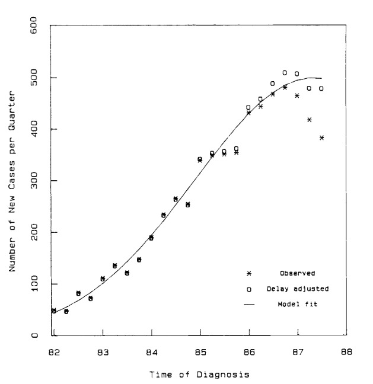

```{r setup, include=FALSE}
options(htmltools.dir.version = FALSE)
knitr::opts_chunk$set(echo = FALSE)

# Initializes the bibliography
library(RefManageR)
BibOptions(check.entries = FALSE,
           bib.style = "authoryear", # Bibliography style
           max.names = 1, # Max author names displayed in bibliography
           sorting = "nyt", #Name, year, title sorting
           cite.style = "authoryear", # citation style
           style = "markdown",
           hyperlink = FALSE,
           dashed = FALSE)
myBib <- ReadBib("references.bib", check = FALSE)
# Note: don't forget to clear the knitr cache to account for changes in the
# bibliography.

knitr::opts_chunk$set(cache=TRUE)

```

```{r xaringan-themer, include=FALSE, warning=FALSE}
library(xaringanthemer)

style_mono_accent(
  title_slide_text_color = "white",
  base_color = "#005BAB",
  inverse_header_color = "white",
  inverse_text_color = "white",
  header_h1_font_size = "2.25rem",
  header_h2_font_size = "2rem")
```

---

## Find us at

.pull-left[

#Rafael Lopes

Associate postdoctoral researcher at Yale University

`r fontawesome::fa("github")` GitHub: [https://github.com/rafalopespx/](https://github.com/rafalopespx/)

`r fontawesome::fa("mail-bulk")` e-Mail: [rafael.lopes@yale.edu](mailto:rafael.lopes@yale.edu)

`r fontawesome::fa("twitter")` Twitter: [@rafalpx](www.twitter.com/rafalpx)

]

.pull-right[

#Leonardo Bastos

Associate Researcher at Fiocruz

`r fontawesome::fa("github")` GitHub: [https://github.com/lsbastos/](https://github.com/lsbastos/)

`r fontawesome::fa("mail-bulk")` e-Mail: [leonardo.bastos@fiocruz.br](mailto:leonardo.bastos@fiocruz.br)

`r fontawesome::fa("twitter")` Twitter: [@leosbastos](www.twitter.com/leosbastos)

]

---

class: middle, center, inverse

# Background & definitions

---

## Observatório COVID-19 BR

The "Observatório COVID-19 BR" is a voluntary scientific and science communication initiative to inform the public debate about the pandemic in Brazil. The "Observatório" comes as a initiative to dispute the polarized debate and focus some of the public attention, on effective measures on what is the pandemic and its impacts on the population. We produce weekly nowcasting estimates for all of 27 states of Brazil, for all 27 state capitals and some others selected cities. 

<br>
<center>


### https://covid19br.github.io/

---

## Notification process

Brazil has many systems to mandatory notification of infectious diseases and grievances of mandatory, normally endemic diseases, such as Dengue, Chikungunya, Zika, HIV, Malaria, Tuberculosis, etc. Syndromic grievances on the sentinel strategies for surveillance, such as Severe Acute Respiratories Illness (SARI), Pedeatric Multi-systemic Inflammatory Syndrome (SIMP, pt-br), Influenza like-illness (SG, pt-br), as well as chronic diseases, as Cancer, Diabetes, etc.

+ __Every single notification system has delays__. Some are caused by notification process itself, some are caused by the natural history of the disease and some are caused by the both.

+ __Nowcasting is the procedure of estimating happening now counts__. Cases, hospitalizations and deaths counts, that were not yet notified, or although has happened and were notified, were accounted on the real-time counts. In summary, short-term data based forecasting.

---

## Viz of delays

It is hard to abstract and understand how delays impacts on cases, hospitalizations and deaths counts. A time line of the notificaiton process can help, every single disease has more than one important date, date of infection, date of onset of first symptoms and date of notification, are the ones we are concerned:

<br>
<center>


---

## Access to dates

Although these 3 dates are of interest, usually we don't have total access to them. Nowcasting acts on the second half of the chain of events, the procedure to estimate dates of infections, is back projection, important on long-term latent period IDs(e.g HIV).

+ __Date of infection__ is always a date that has to be supposed, is hard to capture infection events and there is no true way to measure it. 

+ __Date of onset of first symptoms__, are the most important and are the measure of the pace of an outbreak, it is normally accessible. The time window between Date of infection and Date of onset of first symptoms, is the incubation period, which influences delays on outbreaks notification. 

+ __Date of notification__ are the date in which the count were officially counted, the date when the system "knows" the count. The time window between Date of onset of first symptoms and Date of notification, is the notification delay, and heavily influences the nowcasting estimates.

---

## Delays are misleading

.pull-left[

+ Taking any curve of counts as its face value is misleading, the people, in general, are not trained or informed of such chains of events. 

+ This make the necessity to: 
    + first acknowledge that the counts we are seeing now, are not the real-time facts. 
    
    + Second, not considering the delays and the chain of events, are problematic instance when policies and actions have to be drawn from the data.


]

.pull-right[


]

---

## Delay correction models

The procedure of nowcasting is not new, is being present on actuarial sciences since 1980s:

+ Chain ladder model `r Citet(myBib, "kremer1982ibnr")` 
$$C_{i,j} = E_iS_jR_{i,j}$$

+ Linear mixed models `r Citet(myBib, "renshaw1989chain")`
$$Y_{i,j} = log (C_{i,j}) = \mu + \alpha_i + \beta_j + \epsilon_{i,j}$$

---

## Delay correction on IDs

HIV epidemic has posed a challenge on notification and real-time estimates of incidence as well as case counts, having a long-term latent phase (i.e. the acute phase can emerge over than 10 years after the infection), the cases now diagnosed are probables infections of years ago: 

+ Contributes to the cryptic spreading of the disease

+ Needed to be taking into account when planning policies to mitigate, treat and stop the outbreaks

---

## Delay correction on IDs

.pull-left[

`r Citet(myBib, "zeger1989statistical")` proposed, now classical, model to correct delays and estimate cases:

$$Y_t,u \sim Poisson(\mu_{t,u}), \\ log(\mu_{t,u} = s(t,\beta) + d(\mu, \theta))$$

.footnote[ Figure extracted from: `r Citet(myBib, "zeger1989statistical")` ]

]

.pull-right[


]

---

## Bayesian nowcasting

Bayesian framwework can be used for nowcasting on IDs, as like Dengue and Influenza, examples of application are:

+ `r Citet(myBib, "bastos2019modelling")` via INLA, the model proposed is a _Negative Binomial_, to correct notification delays in Dengue seasonal epidemics in Brazil:

$$n_{t,d} \sim NegBin(\lambda_{t,d}, \phi) \\ log(\lambda_{t,d}) = \mu + \alpha_t + \beta_d + \gamma_{t,d}$$

+ `r Citet(myBib, "mcgough2020nowcasting")`, via MCMC, a _Poisson_ model is proposed for correcting notification delays in influenza outbreaks:
  
$$n_{t,d} \sim Poisson(\lambda_{t,d}) \\ \lambda_{t,d} = \delta_de^{\beta_t}$$

---

## Delay triangle

.pull-left[

The language of nowcasting can be easily visualized by a delay triangle, again on the `r Citet(myBib, "bastos2019modelling")`:

$$n_{t,d} \sim NegBin(\lambda_{t,d}, \phi) \\ log(\lambda_{t,d}) = \mu + \alpha_t + \beta_d + \gamma_{t,d}$$

The random effect $\alpha_t$ to capture the mean temporal evolution of the count-generating process, whereas the $\beta_d$ capture the mean structure of the delay mechanism. These can be modeled using random walks. Lastly, $\gamma_{t,d}$ is the time-delay interaction.

`r Citet(myBib, "bastos2019modelling")` extends this model to a spatial version, with space-time and space-delay interactions.

]

.pull-right[


.footnote[ Figure extracted from: `r Citet(myBib, "bastos2019modelling")` ]

]

---

class: middle, center, inverse

.pull-left[

# Nowcaster R package

]

.pull-right[

# <a href='https://covid19br.github.io/nowcaster'></a> <a href='https://covid19br.github.io/nowcaster'></a>

]

---

## Nowcaster as tool on surveillance

The package born as a need on having a tool that is user-friendly and open to deal with the typical demands on day-to-day of surveillance work. During the first semester of 2022, we wrapped a modification of the model in `r Citet(myBib, "bastos2019modelling")` into an R package. We focused in:

+ Keeping the model simple, fast and good in one thing, estimating the delay due to notification
    
+ Clear usage of the functions, one function to do all the work receiving data almost raw from the SIVEP-Gripe

+ A modified version of this algorithm is in use by _InfoGripe_, _InfoDengue_, surveillance services on outbreaks of Influenza-like Illness and Dengue-like Illness in Brazil

---

## Installing Nowcaster

Nowcaster is a wrapper around a model written in __INLA__, which is not on CRAN, to install and use the package, make sure you have a working installation of INLA, to do so run the following lines in R:

```{r, eval=FALSE, echo=TRUE}
## Installing INLA
install.packages("INLA",
                 repos=c(getOption("repos"),
                         INLA="https://inla.r-inla-download.org/R/stable"), 
                 dep=TRUE)

## Installing Nowcaster
devtools::install_github("https://github.com/covid19br/nowcaster")
```
---

## Nowcaster R Package

Nowcaster wrapper a set of functions for nowcasting the delays, it is based on the __INLA__ R package, which is a **I**ntegrated **N**ested **L**aplace **A**pproximation engine for bayesian inference

+ INLA is faster than the traditional methods of Bayesian inference, as like MCMC and HMC

+ For big-data issues, like nowcasting cases of an ongoing pandemic has a user-friendly language

+ It is limited to models inside the exponential family

+ __Nowcaster__ package works with 2 basic models, a non-age dependent model, which supposes that delays are equally distributed by age-class and a age-dependent model, which stratifies the delays by age-classes

---

## Non-age dependent model

Non-age dependent model has the form: $Y_{t,d} \sim NegBinom(\lambda_{t,d}, \phi)$, which estimates the cases count at time $t$ with delay $d$, $\phi$ is the dispersion parameter.

$$log(\lambda_{t,d}) = \alpha + \beta_{t} + \gamma_{d}$$

where the intercept $\alpha$ follows a Gaussian distribution with a very large variance, $\beta_{t}$ follows a second order random walk with precision $\tau_{\beta}$, $\gamma_{d}$ follows a first-order random walk with precision $\tau_{\gamma}$

---

## Usage non-age dependent model

.pull-left[

```{r, eval=FALSE, echo=TRUE}
# Loading the library
library(nowcaster)
# Loading Belo Horizonte SARI dataset
data(sragBH)
# Calling the nowcasting_inla function
nowcasting_bh_no_age <- 
  nowcasting_inla(
    ## sragBH, the lazydata in the package
    dataset = sragBH, 
    ## "DT_SIN_PRI", 
    ## column of date of onset of symptoms
    date_onset = "DT_SIN_PRI", 
    ## "DT_DIGITA", 
    ## column of digitation date
    date_report = "DT_DIGITA", 
    ## a flag to return the data weekly
    data.by.week = T)
```

]

.pull-right[


]

---

## Age-dependent model

Age dependent model has the form: $Y_{t,d,a} \sim NegBinom(\lambda_{t,d,a}, \phi)$, which estimates the cases count at time $t$ with delay $d$, $\phi$ is the dispersion parameter. Differently, from the non-structured model, now gives random effects to the delay distribution and time distribution by each of the age-class.

$$log(\lambda_{t,d,a}) = \alpha_{a} + \beta_{t,a} + \gamma_{d,a}$$

where each age class, $a$, has an intercept $\alpha_{a}$ following a Gaussian distribution with a very large variance, as before the $\beta$ and $\gamma$ terms are a second-order random walk and a first-order random walk, respectively.

---

## Usage age-dependent model

.pull-left[

```{r, eval=FALSE, echo=TRUE}
## Calling the nowcasting_inla function
nowcasting_bh_age <- 
  nowcasting_inla(
    ## sragBH, the lazydata in the package
    dataset = sragBH, 
    ## "DT_SIN_PRI", 
    ## column of date of onset of symptoms
    date_onset = "DT_SIN_PRI", 
    ## "DT_DIGITA", 
    ## column of digitation date
    date_report = "DT_DIGITA", 
    ## a flag to return the data weekly
    data.by.week = T,
    ## Bins,
    ## into which ages will be classified
    bins_age = "10 years",
    ## Age column
    age_col = "Idade")
```
]

.pull-right[


]

---

## InfoGripe & InfoDengue, CVE

Nowcaster, or modified versions of the model contained in the package are being used for different services in Brazil:

+ __InfoGripe__, is a alert system monitoring the Severe Acute Respiratory Illness (SARI) records, it was the primary alert system during the Covid-19 pandemic, [http://info.gripe.fiocruz.br/](http://info.gripe.fiocruz.br/)

+ __InfoDengue__, is a alert system monitoring the arbovirus suspected notified cases, through the national system for Dengue-like illness notification [https://info.dengue.mat.br/](https://info.dengue.mat.br/)

+ __CVE__, short for the São Paulo State CDC, uses the package as its routinely monitoring on respiratory notified diseases, from SARI state notifications, Influenza-like illness (ILI), RSV pediatric hospitalizations records, measles records, etc.

---

## Takeaways

+ __Delays are everywhere__. This is misleading to unaware people, as well as for policymaker, politicians, journalists and the public debate, first recognize there are delays and after it, take new insights from the data.

+ __ Keep it simple, open and easy to use.__ Policymakers, decision makers and government staff, needs to take hugely impacting decisions in short-term, being simple on what is the problem, how to possibly overcome and the consequences of acting on it helps the dialogue with them. Building tools with user-friendly interfaces that can be incorporated to the workflow.

+ __Always updating, always discussing the results__. Alert systems, surveillance systems, are tools for monitoring IDs on daily or weekly basis, maintaining discussions on the outcome of those tools is essential to grow a community which is engaged on the problem and always tries to come with a solution or new insights.

---

## Acknowledgements

.pull-left[

- To the financing project from Fiotec fellowship, to create the package

- To all sort of help and commentaries that we received through the process, in special from the usage on CVE

]

.pull-right[

# <a href='https://info.dengue.mat.br/'></a> 

# <a href='http://info.gripe.fiocruz.br/'></a>

# <a href='https://www.fiotec.fiocruz.br/en/'></a> 

# <a href='https://www.gov.br/saude/pt-br'></a>
]

---

class: middle, center, hide-logo

# Thank You!
# `r fontawesome::fa("chart-line")` Nowcaster: [**covid19br.github.io/nowcaster**](https://covid19br.github.io/nowcaster)

Submit a PR: 
    `r fontawesome::fa("github")` GitHub: [**https://github.com/covid19/nowcaster**](https://github.com/covid19br/nowcaster)

Reach us on Twitter, until you can: 
    `r fontawesome::fa("twitter")` Twitter: [**@rafalpx**](www.twitter.com/rafalpx)/[**@leosbastos**](www.twitter.com/leosbastos)

---

# References

```{r, results='asis', echo=FALSE, warning=FALSE}
PrintBibliography(myBib)
```
---
class: center, middle, inverse

# Appendix

---

## Priors on Bastos et al. 2019

On `r Citet(myBib, "bastos2019modelling")` model, the $\alpha_t$ and $\beta_d$ covariates are modeled using random walks, as like:

$$\alpha_t = N(\alpha_{t-1}, \sigma_{\alpha}^2), t =  2,3, \dots, T, \\
\beta_d = N(\beta_{d-1}, \sigma_{\beta}^2), d = 1,2, \dots, D$$

With priors distribution of *Half-Normal* $HN(\tau^2)$ for $\sigma_{\alpha}$ and $\sigma_{\beta}$.

---

## Priors Nowcaster

In Nowcaster, we have settled the priors to the random walks for the $\beta_t$ and $\gamma_d$, as like:

$$\beta_t = N(\beta_{t-1}, \sigma_{\beta}^2), t =  2,3, \dots, T, \\
\gamma_d = N(2\gamma_{d-1} - \gamma_{d-2}, \sigma_{\gamma}^2), d = 1,2, \dots, D$$

With priors distribution of *Gamma* $Gamma(10^{-3}, 10^{-3})$ for $\sigma_{\beta}$ and $\sigma_{\gamma}$.

